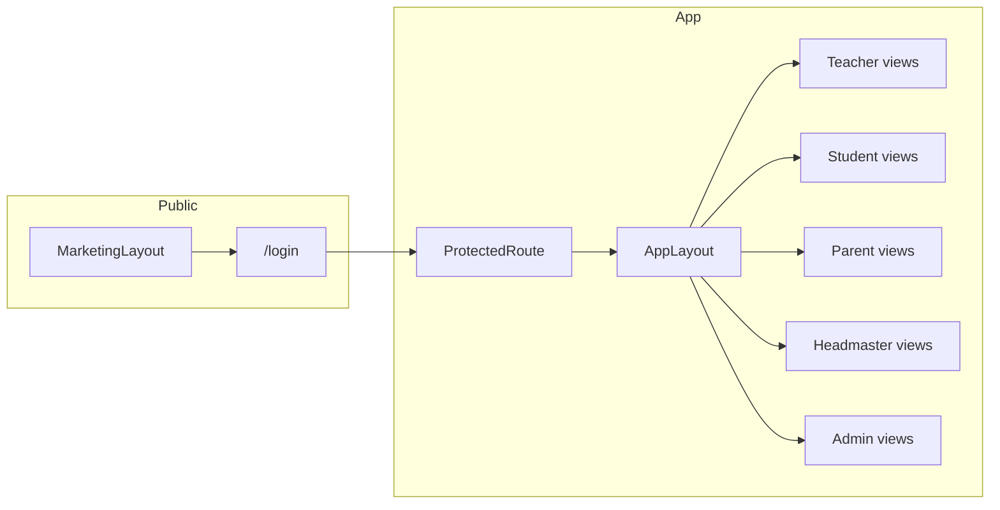

# TMS full UI from PRD (mock auth + dashboards)

## Current state

- Routes live in [`src/App.tsx`](src/App.tsx) under [`MarketingLayout`](src/components/layout/MarketingLayout.tsx); [`SignInPage`](src/pages/SignInPage.tsx) is a non-functional form.
- Branding is ScholarFlow on the marketing site; the PRD describes **Teaching Management System (TMS)** with **five roles** and deep modules (curriculum lifecycle, grades, attendance, timetables, headmaster/admin governance).

## Architectural approach

- **Single-page app, client-only**: mock authentication (e.g. React context or lightweight Zustand store) + `sessionStorage`/`localStorage` for “remember me” and session persistence across refresh.
- **No API**: seed data in TypeScript modules under `src/data/` (or `src/mocks/`) with typed models in `src/types/`.
- **Route split**:
  - **Public**: keep existing marketing routes under `/` (and `/product`, `/pricing`, etc.).
  - **Auth**: `/login` (PRD fields: School ID, Username/Email, Password, Remember me; stub links for Forgot password + Request account).
  - **App**: `/app/*` behind a `ProtectedRoute` that redirects unauthenticated users to `/login`.
- **Layouts**: new [`src/layouts/AppLayout.tsx`](src/layouts/AppLayout.tsx) (or `components/app/AppShell.tsx`) with responsive sidebar + top bar (user, role badge, logout), **nav items derived from role** (PRD §4.2).
- **RBAC**: a `canAccess(path, role)` map or per-route `allowedRoles` on route definitions; Headmaster gets **Admin tools + governance**; Admin gets **Admin tools without** syllabus/change-request **approve** actions (PRD §8).

## Dummy credentials (single school instance)

Define one **School ID** (e.g. `DEMO01`) and five users in [`src/data/dummyUsers.ts`](src/data/dummyUsers.ts) (password can be shared e.g. `demo123` for all—document in file header). Map each user to `role: 'teacher' | 'student' | 'parent' | 'headmaster' | 'admin'`.

- **Teacher**: linked to 1–2 subject/class workspaces in fixtures.
- **Student**: enrolled in subjects; linked parent for parent portal.
- **Parent**: `childrenIds[]` for profile switcher (PRD §7).
- **Headmaster** / **Admin**: same school; fixtures include pending syllabus, change requests, account requests, flags.

Login resolver: `(schoolId, username, password)` → user or null; case-insensitive username optional.

## Domain fixtures (minimum viable but coherent)

Add typed fixtures so screens feel real without implementing every interaction:

| Area | Fixture content |
|------|-----------------|
| School config | Academic year, terms, year groups, subjects, grade/attendance thresholds (PRD §8.8) |
| Curriculum | 1–2 teacher workspaces: topic tree (heading → sub-heading → week), status `draft \| pending \| locked \| change_requested` (PRD §5.2–5.3) |
| Weekly tracking | Weeks with Completed / Partial / Not covered + remarks (PRD §5.3) |
| Resources | Per-topic videos + papers with `visibleToStudents` (PRD §5.4) |
| Grades | Rows per student: category, assessment name, date, value, remarks (PRD §5.5) |
| Attendance | Lesson-level rows; reason codes (PRD §9) |
| Timetable | Weekly grid: subject, class, teacher, room, slot (PRD §10); **v1 UI** can be read-only grid + “builder” placeholder for Admin (full drag-drop as phase 2) |
| Pending tasks | Headmaster: syllabi, change requests, account requests, threshold flags, delivery lag; Admin: accounts, timetable conflicts, incomplete enrolment (PRD §8.1) |

## Screens to implement (grouped by role)

Implement as **modular pages** under `src/pages/app/...` and small presentational components under `src/components/app/...`. Reuse existing Tailwind + `@react-spring/web` patterns where it helps; introduce **shadcn/ui** only if you want faster tables/tabs/dialogs (optional dependency—otherwise native elements + Tailwind).

### Teacher (PRD §5, §9.1)

- **Dashboard**: filters stub + widgets (class average, distribution placeholder, flagged students list from fixtures).
- **Workspaces**: pick subject/class; **Curriculum**: Topic view (tree) + **Week view** (grid); status badge; edit actions **enabled only in Draft** (others show read-only or “submit for approval” stub).
- **Topic detail**: metadata, resource lists, toggles (local state updating fixture copy in memory optional, or read-only first).
- **Weekly tracking**: table per week with status + remarks.
- **Grades**: class roster table + add-row / modal stub.
- **Attendance marking**: roster with Present/Absent/Late + reason (PRD §9.1).
- **Timetable**: read-only weekly view.

### Student (PRD §6)

- **My subjects**: cards with Covered / In progress / Upcoming from tracking fixture.
- **Topic** list + **topic detail** (read-only resources if visible).
- **My performance**: table + simple chart (e.g. CSS bars or lightweight chart lib—add only if needed).
- **Timetable** + **Attendance** (self only).

### Parent (PRD §7)

- **Child switcher** (dropdown) driving all data.
- **Overview**: attendance %, latest grades, curriculum %, alert list.
- **Academic**, **Curriculum** (no resources unless `school.parentResourceAccess` flag in fixture), **Attendance**, **Timetable**.

### Headmaster (PRD §8 + Admin capabilities)

- **Landing = Pending tasks** with inline Approve / Reject / View (update local fixture state so Teacher sees status change).
- **Syllabus review** / **Change request** detail pages (tree read-only + actions).
- **School performance** + **Teacher performance** + **Attendance overview**: filters + summary cards + tables from fixtures.
- **User management** / **School configuration** / **Timetable management**: list + form stubs (same as Admin where overlap).

### Admin (PRD §8.7–8.10, no governance)

- **Pending tasks** subset (no syllabus/change approval buttons; optional “escalate” copy or hidden sections).
- **Users**, **Configuration**, **Timetable**, **Attendance config**: same screens as Headmaster where PRD allows, with **approval/governance controls removed or disabled**.

## Out of scope for this UI prototype (per PRD §2.2 or high effort)

- Real email, notifications, video hosting, external LMS, fees.
- Real file upload to server (UI button + mock success is enough).
- Full drag-drop timetable builder and CSV parse (stub buttons / placeholder second phase).

## Implementation order (recommended)

1. **Types + dummy users + mock login + session + ProtectedRoute + AppLayout + role nav.**
2. **Headmaster pending tasks + syllabus/change request flows** (drives curriculum state visibility for Teacher/Student).
3. **Teacher curriculum + tracking + topic + resources + grades + attendance marking.**
4. **Student + Parent** read-only surfaces using same fixtures.
5. **Admin** variant of headmaster screens + user/config/timetable stubs.
6. **Polish**: 404 for `/app`, logout clears session, marketing header links “Sign in” to `/login`, optional dev “quick login” panel on `/login` for demos.

## Files likely added/touched (high level)

- New: `src/types/*`, `src/data/fixtures/*`, `src/data/dummyUsers.ts`, `src/context/AuthContext.tsx` (or `src/stores/sessionStore.ts`), `src/components/auth/ProtectedRoute.tsx`, `src/layouts/AppLayout.tsx`, `src/pages/app/**/*.tsx`, `src/config/navByRole.ts`.
- Update: [`src/App.tsx`](src/App.tsx) (nested routes: marketing vs app), [`src/pages/SignInPage.tsx`](src/pages/SignInPage.tsx) or replace with dedicated `LoginPage` at `/login`.

## Quality bar

- **WCAG-minded**: focus rings, labels on inputs, semantic landmarks in app shell (align with PRD §11).
- **Responsive**: sidebar collapses to drawer on small screens (matches existing mobile patterns in [`SiteHeader`](src/components/layout/SiteHeader.tsx)).
