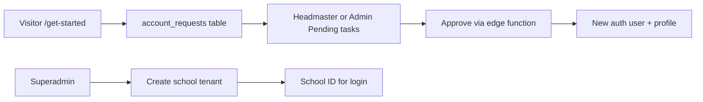

# ScholarFlow — Demo accounts & user flows

All demo passwords: **`demo123`**

## Demo accounts

| School ID | Username | Display name | Role | Email |
|-----------|----------|--------------|------|-------|
| DEMO01 | teacher | Dr. Morgan Chen | Teacher | teacher@demo01.scholarflow.app |
| DEMO01 | student | Alex Rivera | Student | student@demo01.scholarflow.app |
| DEMO01 | parent | Jamie Rivera | Parent | parent@demo01.scholarflow.app |
| DEMO01 | headmaster | Prof. Elena Voss | Headmaster | headmaster@demo01.scholarflow.app |
| DEMO01 | admin | Riley Okonkwo | Admin | admin@demo01.scholarflow.app |
| *(leave blank)* | superadmin | Platform Superadmin | Superadmin | superadmin@scholarflow.app |

Additional demo students (same school, password `demo123`):

| School ID | Username | Display name |
|-----------|----------|--------------|
| DEMO01 | jordan | Jordan Lee |
| DEMO01 | sam | Sam Patel |

**School:** Riverside Academy (`DEMO01`) · Academic year 2025–2026

---

## Sign in

1. Open `/login`
2. **School users:** enter `DEMO01`, username, password
3. **Superadmin:** leave School ID blank, username `superadmin`, password `demo123`
4. You land on your role **Dashboard** (live data from Supabase)

## Forgot password

1. `/forgot-password` — enter School ID (if school user) + username
2. Email link opens `/reset-password`
3. Set new password (min 8 characters) → redirected to login

> Add `http://localhost:5173/reset-password` to Supabase Auth redirect URLs for local dev.

---

## End-to-end flows by role

### 1. New school onboarding (public → superadmin → school)

1. **Superadmin** creates a school (`/app/superadmin/schools`) → external ID e.g. `ACME01`
2. **Visitor** submits `/get-started` → row in `account_requests`
3. **Headmaster/Admin** approves in **Pending tasks** → user created with email/password
4. New user signs in with **School ID + username + password**

### 2. Teacher — curriculum to locked syllabus

1. **Dashboard** — class averages, workspaces, quick links
2. **Workspaces → Curriculum** — edit topics/resources (draft)
3. **Submit for approval** → status `pending`
4. **Headmaster** approves in **Pending tasks** or syllabus review → status `locked`
5. **Tracking / Grades / Attendance** — record delivery and student data
6. **Locked curriculum change** — teacher submits **change request** → headmaster approves

### 3. Student

1. **Dashboard** — grade average, attendance %, curriculum progress
2. **My subjects** — locked curriculum topics and resources
3. **Performance / Timetable / Attendance** — read-only views (RLS)

### 4. Parent

1. **Dashboard** — child attendance, curriculum progress, alerts
2. **Academic / Curriculum / Attendance / Timetable** — read-only for linked child (Alex Rivera)

### 5. Headmaster

1. **Dashboard** — pending counts, flagged students, teachers behind
2. **Pending tasks** — approve/reject syllabi, change requests, account requests
3. **School / Teacher performance** — exports and oversight
4. **Users / Configuration / Timetable / Audit log** — school administration

### 6. Admin

1. **Dashboard** — operational pending items
2. **Pending tasks** — account requests, timetable conflicts (no syllabus approval)
3. **Users** — CRUD via `admin-users` edge function
4. **Configuration / Timetable / Attendance config / Audit log**

### 7. Superadmin (platform)

1. **Dashboard** — schools, users, pending requests (platform-wide)
2. **Schools** — create customer tenants
3. **Account requests** — view all schools’ onboarding queue
4. **Audit log** — cross-tenant audit entries

---

## Navigation

Every role has a **Dashboard** as the first sidebar item. Use **Collapse** at the bottom of the sidebar (desktop) to icon-only mode. State is saved in the browser.

---

## Data source

All dashboard metrics come from **Supabase** (Postgres + RLS). There is no in-browser mock data at runtime.
